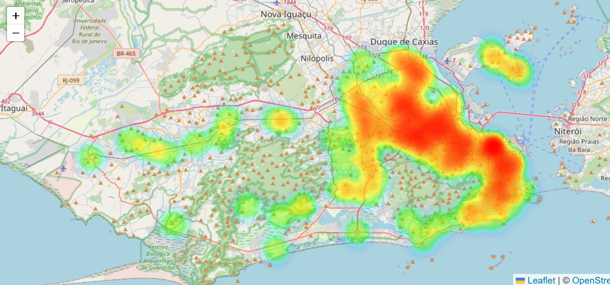
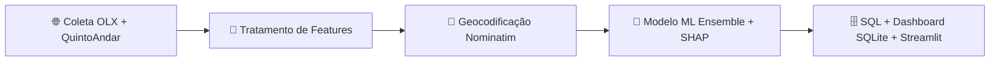
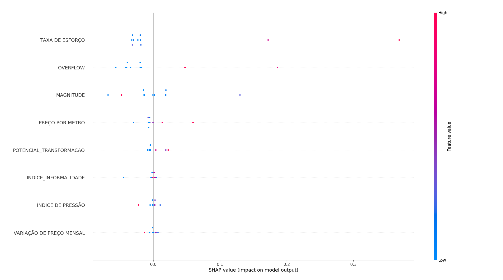

# 🏙️ Gentrificação no Rio: Previsão Automatizada do Deslocamento Urbano

   

> **Um pipeline de ciência de dados espacial, totalmente automatizado, que detecta pressão de deslocamento urbano antes que ela se torne irreversível.** Combina scraping de aluguéis em tempo real, modelagem de contágio espacial e ensemble de ML para gerar, mensalmente, scores de risco de gentrificação para cada bairro do Rio de Janeiro.

---

## 🧩 Sobre o Projeto

O acesso à moradia é o maior desafio socioeconômico das cidades brasileiras nesta década. No Rio de Janeiro, o IGP-M acumulou alta superior a **60% entre 2019 e 2023**. O problema não é a ausência de dados, é o **atraso**. O Censo chega de dez em dez anos. Os artigos acadêmicos documentam bairros que já mudaram. Quando a gentrificação é confirmada na literatura, a comunidade já foi expulsa.

Este projeto foi construído para fechar essa janela. A hipótese central, fundamentada na teoria da *rent gap* de Neil Smith, é que **os preços pedidos nos anúncios de aluguel reagem à pressão de gentrificação meses ou anos antes de ela aparecer nas estatísticas oficiais**. Em vez de documentar o deslocamento depois do fato, o framework detecta as condições estruturais sob as quais ele se torna economicamente inevitável.

Dois fracassos típicos das abordagens existentes são endereçados diretamente:
- A maioria dos modelos trata a gentrificação como um **problema de classificação estático**, ignorando como o capital se expande espacialmente a partir de zonas saturadas para áreas adjacentes subvalorizadas (a *lógica de fronteira* de Harvey).
- Modelos construídos sem dados sobre assentamentos informais **leem errado o mercado imobiliário dual do Rio**, onde grandes porções do território são estruturalmente inacessíveis ao capital formal, uma dinâmica documentada com precisão por Abramo (2003).

---

## 📂 Estrutura do Projeto

```
PROJETO_GENTRIFICACAO_RIO/
│
├── main.py                          # Orquestrador do pipeline: executa todas as etapas em sequência
├── SITE.py                          # Dashboard Streamlit: visualização interativa dos riscos
├── migrar_sql.py                    # Exporta os CSVs finais para SQLite (total + mensal)
├── requirements.txt                 # Todas as dependências Python
│
├── src/
│   ├── collectors/
│   │   ├── WebScrappingFinal.py     # Une OLX + QuintoAndar e calcula mediana de R$/m² por bairro
│   │   ├── coletor_olx.py           # Scraper assíncrono com Playwright para anúncios OLX
│   │   └── coletor_quintoandar.py   # Scraper assíncrono com Playwright para anúncios QuintoAndar
│   │
│   ├── processing/
│   │   └── Tratamento_dados.py      # Engenharia de features: Índice de Pressão, Magnitude,
│   │                                #   Taxa de Esforço, Índice de Informalidade
│   └── models/
│       └── MODELO.py                # Classificador ensemble + análise SHAP + scoring de risco
│
├── output/scripts_graficos/
│   └── GRÁFICO_DE_CALOR.py          # Geocodifica bairros via Nominatim e gera COORDENADAS.csv
│
└── data/
    ├── raw/                         # Arquivos de origem: IPTU, limites de favelas, limites
    │                                #   de bairros, dados de renda do IBGE
    └── processed/
        ├── COORDENADAS.csv          # Arquivo mestre com todas as features + lat/lng
        ├── PREÇO_POR_BAIRRO_TOTAL.csv  # Histórico de mediana ponderada por bairro
        ├── RISCO DE GENTRIFICAÇÃO.csv  # Saída final do modelo com scores de risco
        └── monthly/                 # Recortes mensais com carimbo de data (AAAA_MM)
```

---

## ⚙️ Arquitetura e Matemática

O pipeline executa cinco etapas em sequência, orquestradas pelo `main.py`:



> **Nota sobre robustez estatística:** todas as etapas de precificação utilizam a **mediana** de R$/m² por bairro, e não a média. O mercado de aluguéis do Rio é heterogêneo o suficiente para que um único anúncio fora da realidade local inflacione a média em até 40%, descrevendo uma realidade que nenhum morador típico experimenta. A mediana elimina esse ruído sem descartar os dados.

**Taxa de Esforço** mede não se o aluguel é caro em termos absolutos, mas se ele já ultrapassou o limiar a partir do qual uma família não consegue mais permanecer. Usa uma unidade de referência de 50 m² (padrão do planejamento urbano brasileiro para apartamento de família pequena):

$$EffortRate = \frac{MedianRent \times 50\,m^2}{MonthlyIncome}$$

**Índice de Pressão** é a razão entre o preço por m² e o número de unidades residenciais, operacionalizando a *rent gap* de Smith na escala do bairro: onde a oferta é restrita e os preços sobem, o diferencial entre o valor atual e o valor potencial do solo está se abrindo ativamente.

**Magnitude** combina pressão especulativa com território disponível. A transformação por raiz quadrada corrige a variância extrema da área territorial entre os bairros cariocas:

$$Magnitude = \sqrt{AreaDisponivel} \times IndiceDePressao$$

**Potencial de Transformação** é um composto contínuo de Z-scores que centraliza cada variável em torno da sua média e escala pelo desvio-padrão, tornando sinais de unidades diferentes diretamente comparáveis:

$$TP = \frac{zscore(IndiceDePressao) + zscore(Magnitude) + zscore(TaxaDeEsforco)}{3}$$

**Fator de Transbordamento (Overflow)** é um `KNeighborsRegressor` treinado exclusivamente em coordenadas geográficas (latitude/longitude), codificando a *lógica de comutação espacial do capital* de Harvey. Quando a margem de lucro comprime em uma zona já gentrificada, o investimento migra para áreas adjacentes subcapitalizadas. O KNN é ajustado apenas nas coordenadas de treino, garantindo que as previsões no conjunto de teste operem em localizações nunca vistas, sem vazamento de dados.

### 🔒 Índice de Informalidade: O Mercado Imobiliário Dual do Rio

Antes desta feature existir, o modelo sinalizava **Gardênia Azul**, bairro diretamente contíguo à Barra da Tijuca, com mais de 80% de probabilidade de gentrificação ativa. A lógica espacial fazia sentido. A lógica econômica, não: Gardênia Azul é um bairro onde o capital formal estruturalmente *não consegue entrar*. A regularização fundiária é precária, o financiamento bancário é inviável e nenhuma incorporadora compromete capital em um empreendimento que não pode financiar nem registrar legalmente.

O Índice de Informalidade foi construído para corrigir essa classe de erro. Ele computa a proporção do território de cada bairro ocupada por assentamentos informais (favelas), utilizando os limites georreferenciados da `data.rio` e dados do IPP e do Censo IBGE 2022. O índice funciona como um **travamento estrutural sobre o sinal de Transbordamento**: quando a presença informal é alta, o risco geográfico propagado é suprimido proporcionalmente. Isso operacionaliza a observação de Abramo (2003) de que o Rio sempre operou com dois mercados imobiliários paralelos, com lógicas, liquidez e barreiras de entrada distintas. Um modelo que ignora essa dualidade não está modelando o Rio.

---

## 🚀 Instalação e Execução

```bash
# 1. Clone o repositório
git clone https://github.com/LauroGobatto/PROJETO_GENTRIFICACAO_RIO
cd PROJETO_GENTRIFICACAO_RIO

# 2. Crie e ative um ambiente virtual
python -m venv .venv
source .venv/bin/activate        # Linux/macOS
.venv\Scripts\activate           # Windows

# 3. Instale as dependências
pip install -r requirements.txt

# 4. Instale o motor de navegador do Playwright
playwright install chromium

# 5. Execute o pipeline completo
python main.py

# 6. Suba o dashboard interativo
streamlit run SITE.py
```

> ⚠️ Os arquivos brutos (`IPTU_RESIDENCIAL.csv`, `LIMITE_FAVELAS.csv`, `RENDA_POR_BAIRRO.csv` etc.) precisam estar presentes em `data/raw/` antes de rodar a etapa de tratamento. O scraper requer conexão ativa com a internet e pode levar de 20 a 40 minutos na primeira execução.

---

## 📊 Desempenho, Métricas e Viés de Modelagem

O dataset contém aproximadamente **110 a 120 bairros** após filtrar áreas com menos de 15 anúncios ativos, um regime genuinamente difícil para aprendizado de máquina. Bairros em Gentrificação Ativa e em Pré-Gentrificação são raros por definição, o que torna classificadores ingênuos inúteis: eles atingem alta acurácia prevendo a classe majoritária para quase todo input, errando justamente os casos que mais importam.

| Componente | Escolha | Justificativa |
|---|---|---|
| Reamostragem | SMOTE-Tomek | Gera exemplos sintéticos da classe minoritária por interpolação e remove ruído de fronteira via Tomek Links |
| Métrica de otimização | **Recall Ponderado** | Um alerta de deslocamento perdido é um erro mais grave do que um falso positivo |
| Ensemble | Soft-voting (RF + GBM) | Reduz variância em datasets pequenos ao calcular a média das probabilidades estimadas |
| Validação cruzada | StratifiedKFold (k=5) | Reamostragem aplicada por fold, sem vazamento de dados em nenhuma etapa |
| Velocidade de coleta | ~1,1s/bairro | vs. 4,2s de baseline; alcançado com Playwright async + interceptação de requisições |

### 🔬 Análise SHAP: Deslocamento como Transição de Fase

Os valores SHAP revelam três resultados que desafiam o monitoramento habitacional convencional:

1. **A Taxa de Esforço age como um limiar, não como um gradiente.** A maioria dos bairros se agrupa abaixo de um ponto crítico de acessibilidade. Um pequeno número cruzou esse limiar completamente. O modelo responde a esse *colapso*, não a uma deterioração gradual, o que significa que a janela de intervenção é mais estreita do que a maioria das políticas habitacionais supõe. Essa é exatamente a dinâmica de transição de fase que Lefebvre (1991) descreveu: o momento em que o valor de uso é inteiramente subordinado ao valor de troca, e o bairro deixa de ser produzido para seus moradores e passa a ser produzido para o mercado.

2. **O Fator de Transbordamento supera todas as variáveis censitárias.** Uma feature sem nenhuma informação econômica, apenas coordenadas geográficas, tem mais poder preditivo do que renda, preço e densidade. Isso confirma empiricamente a lógica de fronteira de Harvey: para onde o capital já foi prevê para onde ele vai melhor do que as condições socioeconômicas locais atuais. As decisões de deslocamento passadas da cidade estão moldando ativamente as futuras.

3. **A variação mensal de preços é praticamente irrelevante.** Uma vez que o contexto de renda está codificado pela Taxa de Esforço, a velocidade de alta dos preços não acrescenta quase nada. A cidade não está se tornando inacessível porque os aluguéis estão subindo, ela está inacessível porque os aluguéis já subiram além do que os moradores conseguem sustentar. Monitorar a variação de preço sem monitorar o *hiato* entre essa variação e a renda local não é alerta precoce. É documentação tardia.

---

## 🔗 Links e Call to Action

| | Recurso | Link |
|---|---|---|
| 💻 | Código-Fonte (GitHub) | [github.com/LauroGobatto/PROJETO_GENTRIFICACAO_RIO](https://github.com/LauroGobatto/PROJETO_GENTRIFICACAO_RIO) |
| 🗺️ | Dashboard Interativo (Streamlit) | [gentrificacaorio.streamlit.app](https://gentrificacaorio.streamlit.app) |
| 📦 | Fontes de Dados | [data.rio](https://www.data.rio) · Censo IBGE 2022 · Instituto Pereira Passos |

**Referências teóricas:** Smith (1996) · Harvey (1989) · Marcuse (1985) · Lefebvre (1991) · Abramo (2003) · Santos (1996)

---

*O pipeline é open source, a metodologia é reproduzível e o dashboard é público. Se este trabalho for útil para sua pesquisa ou para sua cidade, abra uma issue ou entre em contato.*

**Referências teóricas:** Smith (1996) · Harvey (1989) · Marcuse (1985) · Lefebvre (1991) · Abramo (2003) · Santos (1996)

---

*O pipeline é open source, a metodologia é reproduzível e o dashboard é público. Se este trabalho for útil para sua pesquisa ou para sua cidade, abra uma issue ou entre em contato.*
